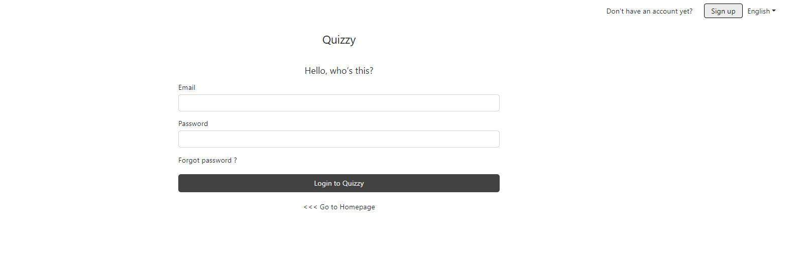
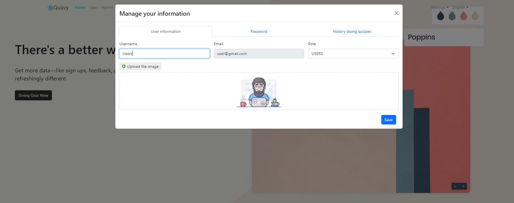
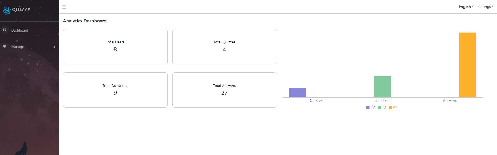

# Quizzy Website

This is a website that helps you do tests.

## Feature of this Project

## A. Admin can

1. Login
2. Sign up
3. Doing quiz
4. Manage user(Add, Update, Delete)
5. Manage quizzes(Add, Update, Delete)
6. Manage questions(Add, Update, Delete)
7. Assign quiz to user
8. Manage information(password, username, email, history doing quiz)

## B. User can

1. Login
2. Sign up
3. Doing quiz
4. Manage information(password, username, email, history doing quiz)

## 📸 ScreenShots










## Support Developer

1. Add a Star 🌟 to this 👆 Repository
2. Follow on Github

## How to Install and Run this project?

### Pre-Requisites:

1. Install Git Version Control
   [ https://git-scm.com/ ]

2. Install Nodejs Latest Version
   [ https://nodejs.org/en/download/package-manager ]

3. Install Docker
   [ https://docs.docker.com/desktop/install/windows-install/ ]

4. Install DBeaver
   [ https://dbeaver.io/download/ ]

### Installation

**1. Create a Folder where you want to save the project**

**2. Create DB**
Open DBeaver: create connection-> select postgres database-> fill in username, password, port

**3. Run Docker**
Make sure docker is running Check by typing: docker -v 3

```
$  docker compose -p quiz-react-backend up -d
```

**4. Clone this project**

```
$  git clone https://github.com/biennc/Quiz_ReactJS.git
```

Then, Enter the project

```
$  cd Quiz_ReactJS
```

**5. Runs the app in the development mode**

```
$  npm start
```

## For Sponsor or Projects Enquiry

1. Email - biennguyen3428@gmail.com
